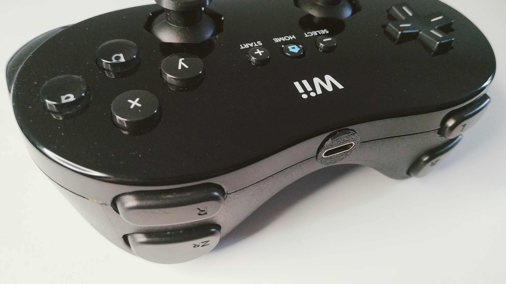

# Wii Classic Bluetooth gamepad

Bluetooth conversion of the Wii Classic gamepad using an Esp32.
Uses [NintendoExtensionCtrl](https://github.com/dmadison/NintendoExtensionCtrl) to read the controller and [ESP32-BLE-Gamepad](https://github.com/lemmingDev/ESP32-BLE-Gamepad) to do Bluetooth things.

## Features

- Analog joysticks with [scaled radial deadzone](https://github.com/Minimuino/thumbstick-deadzones)
- auto sleep
- manual sleep
- analog sticks calibration
- dual core: reporting to bluetooth takes place in one core, and reading inputs in another. This ensures the lowest possible latency

## Usage

- Wake from sleep: home button
- Force sleep: keep select pressed for 5 seconds
- Auto sleep: no inputs for 5 minutes
- Calibration mode: keep X pressed while it wakes from sleep

## Calibration mode

- Press home to wake the controller from sleep, keeping X pressed for a few seconds
- Keep the analog sticks in their center position, then press select
- Move the analog sticks to their full range, then press select
- The Esp32 saves the calibration data to the internal eeprom then reboots

## Issues

- No external leds: I should add some to see what's going on (connected / disconnected / calibration mode, low battery, etc)
- Reading the classic controller through i2c is "slow". I measured between 3 and 5 ms.

## Parts used

- Platformio: to build and flash the code
- Esp32 board: Lolin32 lite because it's cheap on aliexpress and has an integrated lipo charger
- Lipo battery: I used an 802535 (600mah) because it fits nicely
- USB C connector with breakout board: the shorter & narrower the better. I used a fairly large one and I had to trim the controller pcb a tiny bit to make it fit
- Stuff to trim the shell: craft files, flush cutters, (low) power tools
- A 3d printer to print the usb gasket
- Superglue to glue the USB connector to the gasket, and the gasket to the shell
- 30awg solid core wire, solder, flux
- Hot air or hot plate to remove the battery connector from the Esp32
- Double sided tape to secure the Esp32 and the battery

## How I built it

- Disassembled the controller, trimmed the shell (look in [/img](/img))
- Desoldered the battery connector from the Esp32 since it's too tall otherwise
- Taped the Esp32 to the bottom pcb (the one with the analogs) carefully and making sure it fit within the shell. Then I trimmed more
- Soldered i2c pins, 3v and ground to the relative Esp32 pins
- Soldered the top pin of the home switch to the Esp32. This needs to be an RTCIO pin as it will be used to wake the Esp32 from sleep
- Soldered the usb connector to the Esp32. I had to use the legs of the CH340C (pin 5 D+, pin 6 D-) and a diode (5v), as the Esp32 does not expose pads for usb connection
- Soldered the battery to the battery pads
- Taped the battery to the back of the Esp32, making sure everything fit, and making sure I could still screw the pcb to the front shell. Then I trimmed more
